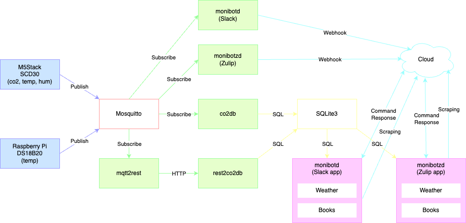

# CO2
*CO2* system collects data and reports it using Slack or Zulip:
1. [SCD30 sensor on M5Stack](m5stack) or [DS18B20 sensor on Raspberry Pi](raspberry-pi) measures Carbon dioxide level, temperature or humidity and publishes them to Mosquito MQTT broker.
2. [co2db](logger) subscribes them and stores in SQLite server.
3. [monibot](bot), which is Slack or Zulip app, serves up real-time data and graphs.
4. monibot also serves weather forecast from OpenWeather (and books status in libraries).

