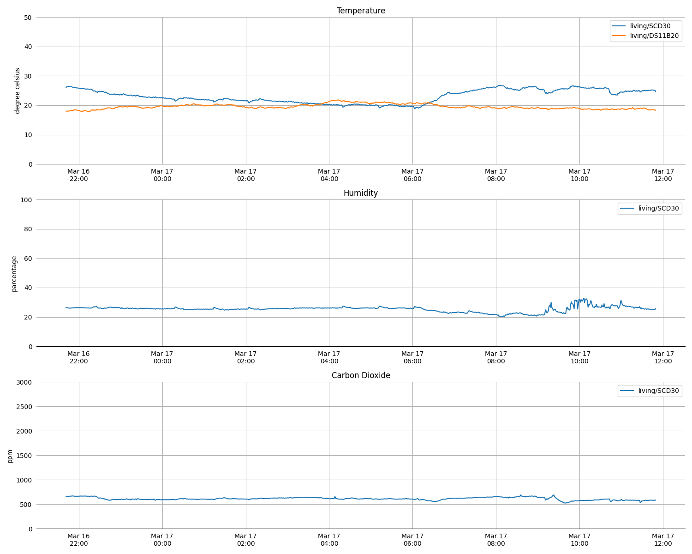

# CO2Plot


## Requrement
### Packages
- matplotlib(3.3.4)
- numpy(1.20.1)
- pandas(1.2.3)
- dateutil(2.8.1)
- pytz(2021.1)
- slack_bolt(1.6.1)

### Packages for tests
- freezegun(1.1.0)
- pytest(6.2.4)

### Library
- libsqlite3-0(3.31.1-4ubuntu0.2)

You can install the packages in bulk.
```Shell
$ pip install -r requirement.txt
```


## SQLite3 schema
```SQL
CREATE TABLE IF NOT EXISTS measurement (
    timestamp INTEGER PRIMARY KEY,
    topic TEXT,
    payload TEXT
);
```
Unix time nanoseconds is used as *timestamp*. 
The following is an example of the table.
```SQL
sqlite> select timestamp, topic, payload from measurement;
1615949110073652477|living/SCD30|25.2 24.9 582
1615949170137723196|living/SCD30|25.1 25.1 579
1615949230202348740|living/SCD30|25.1 25.0 578
1615949290265383071|living/SCD30|25.1 25.1 583
1615949350346302793|living/SCD30|24.7 25.6 584
1615898516178925437|living/DS11B20|18.0
1615898576244004264|living/DS11B20|18.0
1615898636302554140|living/DS11B20|18.0
1615898696363437214|living/DS11B20|18.0
1615898756427165960|living/DS11B20|18.0
```
In the example *payload* contains temperature(℃), humidity(%) and CO2(ppm).


## co2plot.json
```JSON
{
  "database": "measurement.db",
  "table": "measurement",
  "axes": [
    {
      "name": "Temperature",
      "unit": "degree celsius",
      "max": 50.0,
      "min": 0.0,
      "data": [
        {
          "topic": "living/SCD30",
          "column": 0
        },
        {
          "topic": "living/DS11B20",
          "column": 0
        }
      ]
    },
    {
      "name": "Humidity",
      "unit": "parcentage",
      "max": 100.0,
      "min": 0.0,
      "data": [
        {
          "topic": "living/SCD30",
          "column": 1  
        }
      ]
    },
    {
      "name": "Carbon Dioxide",
      "unit": "ppm",
      "max": 3000,
      "min": 0,
      "data": [
        {
          "topic": "living/SCD30",
          "column": 2  
        }
      ]
    }
  ]
}
```


## Usage
```Shell
$ python3 co2plot.py -h
usage: co2plot.py [-h] [-p PNG] [-c CONFIG] [-d DAYS] [-n]

CO2 plot from SQLite

optional arguments:
  -h, --help            show this help message and exit
  -p PNG, --png PNG     Output PNG filename
  -c CONFIG, --config CONFIG
                        Axes configuration
  -d DAYS, --days DAYS  Plot data from "days" to today
  -n, --now             Display latest value
$
```

## Test
```Shell
python3 -m pytest tests
```

## References
- [Python3でSlack APIを使用してBotを作成](https://qiita.com/YoheiHayamizu/items/a385f59d90e2a9c4d1a1)
  
- [SlackのtokenとAPI、botの種類をまとめた](https://qiita.com/tkit/items/2536ea6971754f9a75d1)

- [Slack Bolt for Pythonを使ってのbot構築。ローカル開発からHerokuデプロイまで](https://qiita.com/geeorgey/items/c1e147eda40f6d652446)
